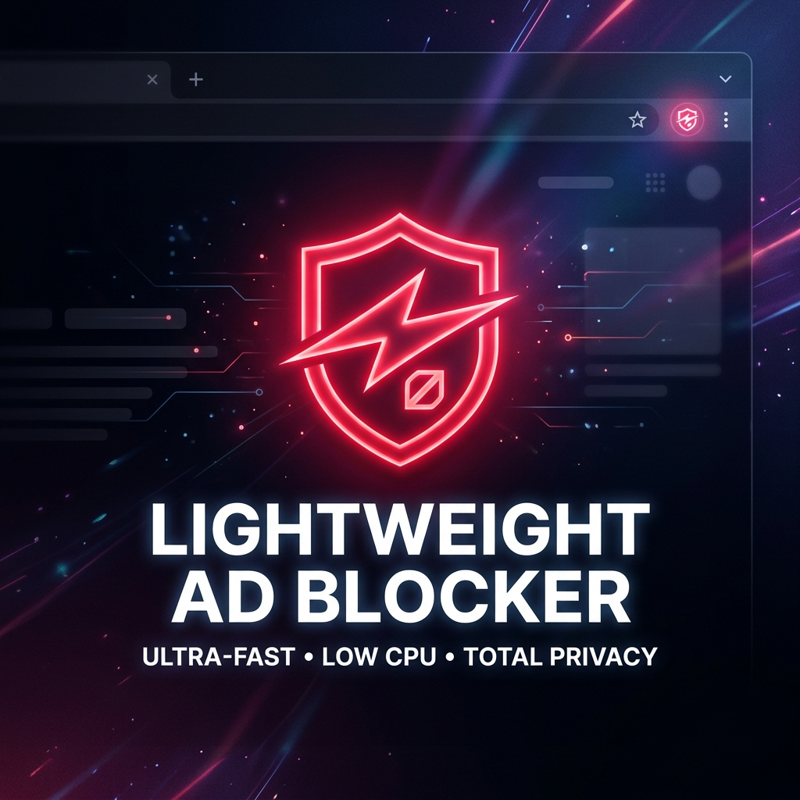
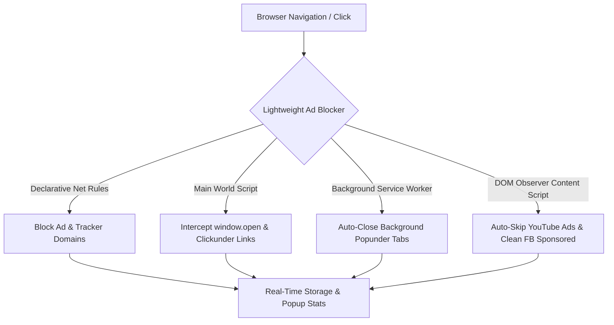

<div align="center">

  

  # ⚡ Lightweight Ad Blocker

  **Ultra-fast Manifest V3 extension featuring Popunder & Clickunder Protection, YouTube Video Ad Auto-Skip, Facebook Sponsored Feed Cleaner, and Cyber Dark UI.**

  [](https://developer.chrome.com/docs/extensions/mv3/intro/)
  [](#installation)
  [](#license)
  [](#features)

  <br>

  <!-- Extension Promotional Banner Image Placeholder -->
  <p align="center">
    
  </p>

</div>

---

## ✨ Key Features

| Feature | Description | Protection Level |
| :--- | :--- | :---: |
| 💥 **Popunder & Clickunder Shield** | Intercepts `window.open`, link hijacking, and synthetic clicks on movie/streaming sites (Full4Movies, Cinevo, 1xBet, 1xlite, OKX redirects). | **100% Active** |
| ⚡ **YouTube Video Ad Auto-Skip** | Auto-mutes video ads, fast-forwards playback at **16x speed**, auto-clicks "Skip Ad" buttons, and cleans home feed ad cards. | **Instant** |
| 👥 **Facebook Sponsored Cleaner** | DOM MutationObserver detects and removes "Sponsored" posts, hidden SVG tags, and right-rail ads without leaving blank gaps. | **Seamless** |
| 🛡️ **140+ Network Rules** | Blocks DoubleClick, Google AdSense, Taboola, Outbrain, Criteo, PubMatic, popunder ad networks, and tracking pixels. | **High Performance** |
| 🎨 **Cyber Dark Animated UI** | Sleek glassmorphic popup interface with real-time threat counters, animated counter-up effect, and toggle switches. | **Dynamic** |

---

## 🖼️ Extension Preview & Interface

<div align="center">

  <table>
    <tr>
      <td align="center">
        <b>🚀 Cyberpunk Popup Interface</b><br><br>
        <!-- Extension Popup Screenshot Placeholder -->
        
      </td>
      <td align="center">
        <b>🛡️ Real-Time Protection Badge</b><br><br>
        <!-- Extension Store Icon Placeholder -->
        
      </td>
    </tr>
  </table>

</div>

---

## 🔬 How It Works (Architecture)



<details>
<summary><b>🔍 Deep Dive: Popunder & Clickunder Protection</b></summary>

<br>

Streaming and movie sites use script techniques to hijack mouse clicks and open unwanted casino, betting, or redirect tabs:
- **Main World Script ([content_main.js](content_main.js))**: Runs directly in the web page scope at `document_start` to neutralize `window.open` and synthetic link `.click()` triggers.
- **Navigation Monitor ([background.js](background.js))**: Listens to `chrome.webNavigation.onBeforeNavigate` and `chrome.tabs.onCreated` to destroy popunder tabs instantly before they finish loading.

</details>

<details>
<summary><b>⚡ Deep Dive: YouTube Ad Fast-Forward Engine</b></summary>

<br>

- Continuously monitors YouTube HTML5 `<video>` player state.
- When a video ad starts, it immediately:
  1. Mutes audio (`video.muted = true`)
  2. Accelerates playback to `16.0x` speed
  3. Sets `video.currentTime` to duration
  4. Clicks `.ytp-ad-skip-button` / `.ytp-skip-ad-button` automatically

</details>

<details>
<summary><b>👥 Deep Dive: Facebook Sponsored Feed Cleaner</b></summary>

<br>

- Uses a `MutationObserver` targeting Facebook feed wrappers.
- Detects sponsored markers using multi-layer inspection:
  - Text matching ("Sponsored", "Promoted")
  - Hidden SVG `use` tags (`sp_`)
  - Target links pointing to `/ads/about`
- Hides matching containers with `display: none !important;` cleanly.

</details>

---

## 📥 Installation Guide

1. **Clone or Download Repository**:
   ```bash
   git clone https://github.com/itsniranjannn/Adblocker.git
   ```

2. **Open Extensions Page in Chrome**:
   - Open Google Chrome, Brave, or Edge.
   - Navigate to `chrome://extensions` in your address bar.

3. **Enable Developer Mode**:
   - Toggle **Developer mode** in the top-right corner.

4. **Load Unpacked Extension**:
   - Click **Load unpacked** button.
   - Select the `Adblocker` project directory.

5. **Enjoy Ad-Free Browsing**:
   - Click the extension icon in your browser toolbar to view live blocked threat counters!

---

## 🛠️ Project Structure

```
adblocker/
├── manifest.json         # Extension Manifest V3 configuration
├── background.js          # Service worker for popunder closing & stats
├── content_main.js       # Main world window.open & clickunder interceptor
├── content.js            # YouTube auto-skipper & Facebook sponsored cleaner
├── cosmetic.css          # Global cosmetic ad hiding stylesheet
├── rules.json            # 140+ DeclarativeNetRequest blocking rules
├── popup.html            # Cyber dark glassmorphism popup UI
├── popup.js              # Popup stats renderer & toggle sync
├── icons/                # High-res extension icons & promo banner
│   ├── icon16.png
│   ├── icon48.png
│   ├── icon128.png
│   ├── icon512.png
│   └── promo_banner.png
├── .gitignore            # Git exclusion rules
└── README.md             # Repository documentation
```

---

<div align="center">

  Made with ❤️ for an ultra-fast, ad-free web.

</div>
